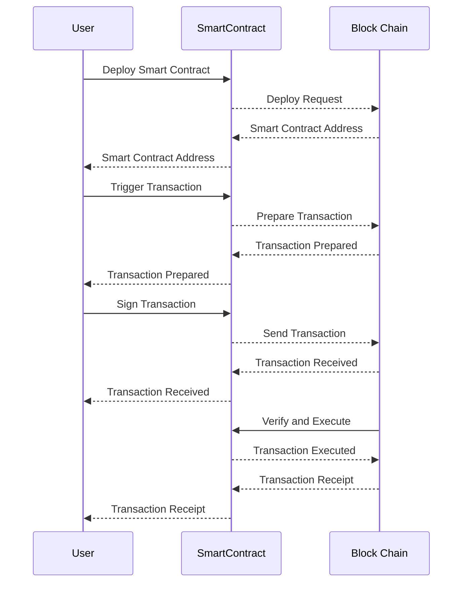

# Sample Hardhat Project

This project demonstrates a basic Hardhat use case. It comes with a sample contract, a test for that contract, and a script that deploys that contract.

Try running some of the following tasks:

```shell
npx hardhat help
npx hardhat test
REPORT_GAS=true npx hardhat test
npx hardhat node
npx hardhat run scripts/deploy.ts
```

- ウォレットアドレス: ユーザーが暗号通貨を保管し、送受信するためのアドレス。これは通常、プライベートキーから導き出され、ユーザーが取引を行うために他のユーザーと共有することがあります。

- ノードアドレス: ブロックチェーンネットワーク上で実行されているノード（コンピュータ）を特定するためのアドレス。ノードはネットワーク上でトランザクションやブロックの伝播、検証を担当します。

- トランザクションハッシュ: ブロックチェーン上で行われたトランザクションを一意に識別するためのハッシュ。このハッシュは通常、トランザクションの署名、送信元アドレス、受信先アドレス、金額などの情報を含んでいます。

- コントラクトアドレス: スマートコントラクトがデプロイされたアドレス。スマートコントラクトはプログラム可能な条件で自動的に実行されるコードです。デプロイされたスマートコントラクトは一意のアドレスを持ち、そのアドレスを使用してコントラクトとやり取りします。

スマートコントラクトのプログラムは通常、Webサーバー上に配置されず、そのコードが直接ブロックチェーン上で実行されます。スマートコントラクトは分散型アプリケーション（DApp）やブロックチェーンネットワークにおいて、デセントラルなコンピューティング環境で動作することが意図されています。

1. スマートコントラクトの作成: 開発者は、スマートコントラクトをプログラミング言語で記述します。一般的なスマートコントラクトの開発言語にはSolidityがあります。スマートコントラクトは通常、特定の機能や条件に基づいてプログラムされ、ブロックチェーン上で自己実行可能です。

1. スマートコントラクトのコンパイル: 開発者は、スマートコントラクトをブロックチェーンが理解できる形式に変換するために、対応するプログラミング言語のコンパイラを使用します。Solidityのスマートコントラクトは通常、Ethereumなどのブロックチェーン上で使用されます。

1. デプロイメントトランザクションの作成: 開発者は、デプロイするスマートコントラクトとその初期設定に関する情報を含むトランザクションを作成します。このトランザクションには、スマートコントラクトのバイトコード（コンパイルされたコード）も含まれます。

1. デプロイメントトランザクションの署名と送信: トランザクションが署名され、ネットワークにブロードキャストされます。トランザクションが承認され、ブロックに含まれると、スマートコントラクトがブロックチェーン上にデプロイされます。

1. スマートコントラクトのアドレス取得: デプロイが完了すると、ブロックチェーンはスマートコントラクトに割り当てられた一意のアドレスを返します。このアドレスを使用して、他のユーザーがスマートコントラクトとやり取りできるようになります。

1. スマートコントラクトの実行: 他のユーザーは、スマートコントラクトのメソッドを呼び出し、トランザクションを生成して実行できます。これにより、スマートコントラクトがプログラムされた機能や条件に基づいて動作します。



シーケンス図では、一連の処理が1つのトランザクションノード（取引ノード）に対して行われるフローを示しています。トランザクションノードはブロックチェーンネットワークの一部であり、ユーザーがデプロイ、トランザクションの署名、送信、スマートコントラクトの実行などのアクションを行います。

1つのトランザクションノードで行われるフローは、デプロイからトランザクションの実行まで、その一部としてまとめられています。各ノードはこのプロセスの一部を担当し、ブロックチェーン上で分散された一貫性のある状態を維持します。

ブロックチェーンでは、ネットワーク全体が分散されたデータベースを形成し、ユーザーがトランザクションを行うためにはノードが共同作業を行います。そのため、トランザクションは分散されたネットワーク上で処理され、一連のアクションが1つのトランザクションノードによってまとめて実行されます。

スマートコントラクトのガス代は、Ethereumネットワーク上でトランザクションを実行する際にかかります。スマートコントラクトがガス代を消費する主なタイミングは以下の通りです。

- デプロイ時： スマートコントラクトが初めてEthereumネットワークにデプロイされる際には、デプロイのためのガスが必要です。デプロイ時にはコントラクトのコードが実行され、必要なガスが消費されます。

- 関数呼び出し時： スマートコントラクトが提供する関数を呼び出すたびに、その関数が実行される際にガスが必要です。関数の実行には、計算やデータの変更などが含まれ、それに対するガスが消費されます。

- トランザクションの状態変更時： スマートコントラクトがデータを変更するトランザクションを送信する場合、そのトランザクションがブロックチェーン上に書き込まれ、状態変更が確定されると、ガスが消費されます。

- 外部のスマートコントラクトへの呼び出し時： あるスマートコントラクトが別のスマートコントラクトを呼び出す場合も、その呼び出しにかかるガスが発生します。

これらのタイミングで発生するガス代は、ネットワーク上での処理のためのリソース（計算力やネットワーク帯域など）を確保するために支払われるものです。ガス代はトランザクションの実行者によって支払われます。

ETHEREUM GOERLI FAUCETについて

24時間に0.02 Goerli ETHが限度